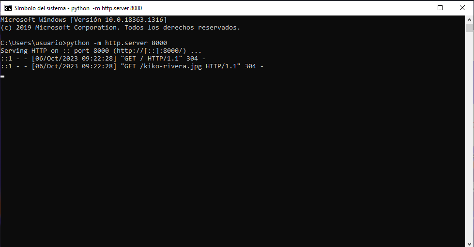
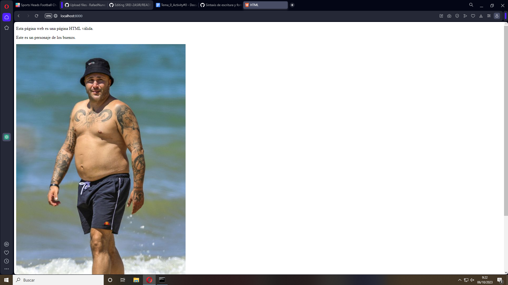

En primer lugar creamos una página web con nuestro editor favorito

Una vez hemos creado y guardado nuestra página index.html, cuando arranquemos el servidor local, cargará la misma por defecto. 

Una vez hemos arrancado el servidor local podemos comprobar si funciona correctamente mediante el nanvegadro, buscamos localhost:8000

