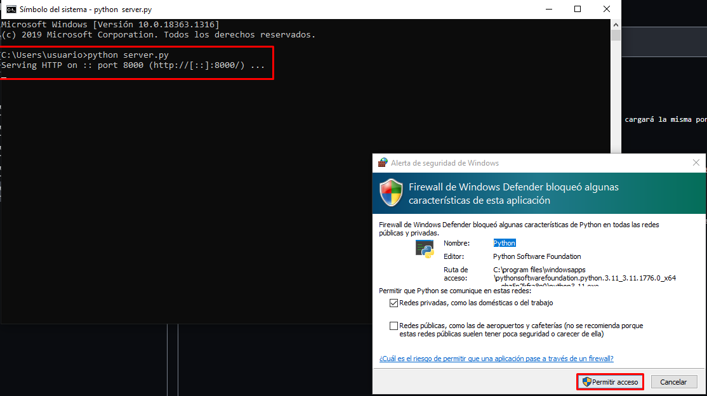

En primer lugar creamos una página web con nuestro editor favorito

Una vez hemos creado y guardado nuestra página index.html, cuando arranquemos el servidor local, cargará la misma por defecto. 

Usado el comando: python -m http.server 8000, hemos arrancado el servidor local podemos comprobar si funciona correctamente buscamos en el navegador, buscamos localhost:8000

Podemos hacer lo mismo usando un archivo de lenguaje python que es un servidor, una vez tenemos el código podemos ejecutar el archivo.

Mi servidor tiene este código fuente (haz click en el enlace para verlo) [Servidor web python](Servidorweb.py)

Este servidor tiene más funciones añadidas que el anterior servidor local, voy a ejecutarlo y comprobar si funciona.

Para ejecutarlo escribo en la cmd: python "nombre_archivo.py" hay que indicar el formato de archivo que tiene .py en este caso.
Tambien nos indica el numero de puerto que ocupa sus servicios.

